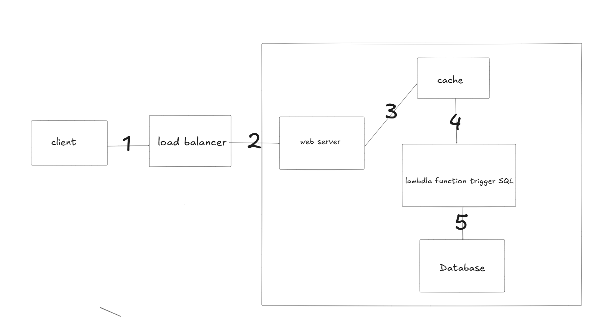

# Scoreboard API Service

## Overview

The Scoreboard API Service manages and updates user scores in real-time on the scoreboard. It ensures that scores are updated promptly and provides real-time access to the top scorers.

## Functional Requirements

-   **Update Score**: Users can update their scores, which will be reflected in real-time on the scoreboard.
-   **Real-Time View**: Users can view the top 10 highest scores on the scoreboard.
-   **Authorization and Validation**: The system validates users to avoid malicious interactions and ensures only authorized users can update scores.

## Non-Functional Requirements

-   **Real-Time Updates**: The system must ensure that scores are updated in real-time.

## API Design

### 1. **POST** `/authenticate/`

-   **Purpose**: Authenticate a user and return a JWT token for authorization.
-   **Request**:
    -   **Body**:

        ```json
        {
          "username": "string",
          "password": "string"
        }
        
        ```

-   **Response**:
    -   **200 OK**:

        ```json
        {
          "jwt_key": "string"
        }
        
        ```

-   **Error Responses**:
    -   **400 Bad Request**: Missing required fields or invalid input.
    -   **401 Unauthorized**: Invalid credentials.

### 2. **PUT** `/users/:user_id/scores`

-   **Purpose**: Update the score of a user.
-   **Authentication**: The request must include a valid JWT token in the header.
-   **Request**:
    -   **Headers**:

        ```json
        {
          "Authorization": "Bearer <jwt_token>"
        }
        
        ```

    -   **Body**:

        ```json
        {
          "score": "number",
          "game_id": "string"
        }
        
        ```

-   **Response**:
    -   **200 OK**: Score updated successfully.
    -   **400 Bad Request**: Invalid score value or missing required fields.
    -   **401 Unauthorized**: Invalid JWT token or unauthorized access.
    -   **404 Not Found**: User not found.

### 3. **GET** `/scoreboard/:game_id/top/:count`

-   **Purpose**: Retrieve the top `:count` users based on their scores.
-   **Request**:
    -   **Params**:
        -   `count`: The number of top users to retrieve (e.g., `/top/10`).
-   **Response**:
    -   **200 OK**:

        ```json
        {
          "total": 10,
          "updated_at": "2030-10-10T12:11:42Z",
          "scores": [
            {
              "user_id": "string",
              "username": "string",
              "score": "number"
            },
            ...
          ]
        }
        
        ```

-   **Error Responses**:
    -   **400 Bad Request**: Invalid `count` parameter.

## Database Design


-   **Users Table**:
    -   `user_id` (Primary Key)
    -   `username`
    -   `password`
    -   `updated_at`
    -   `created_at`
-   **ScoreBoard Table**:

    -   `scoreboard_id` (Primary Key)
    -   `user_id`
    -   `game_id`
    -   `score`
    -   `updated_at`
    -   `created_at`
-   **Games Table**:

    -   `game_id` (Primary Key)
    -   `name`
    -   `created_at`
    -   `updated_at`

## High-Level Design


### 1. **User Views the Scoreboard**
-   The client creates a WebSocket connection to the load balancer for real-time communication.
-   The load balancer delegates the client’s request to the closest data center.
-   The server queries the cache server to display the scoreboard.


### 2. **User Updates the Score**
-   The client creates a WebSocket connection to the load balancer for real-time communication.
-   The load balancer delegates the client’s request to the closest data center.
-   The server updates the score in the sorted set data type in Redis.
-   After writing to the cache, the server also syncs the data in Redis to the database.
